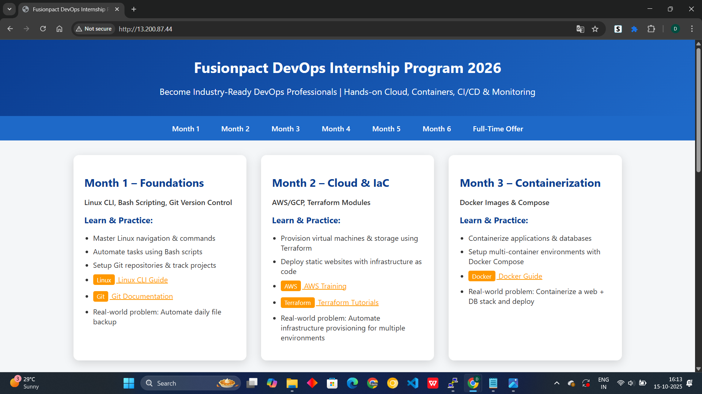
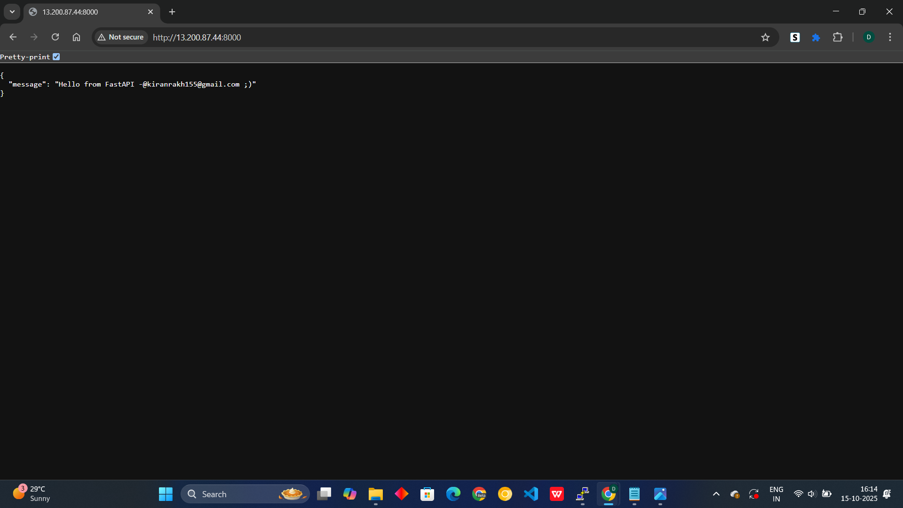
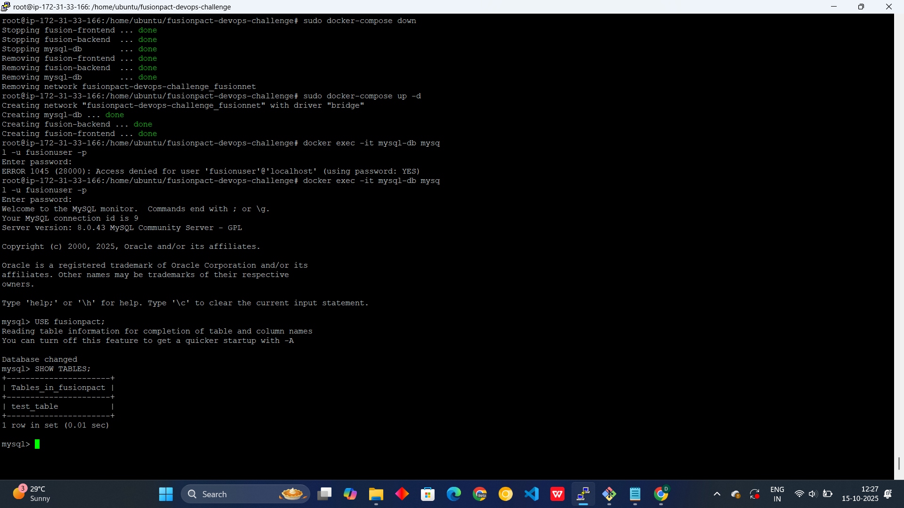
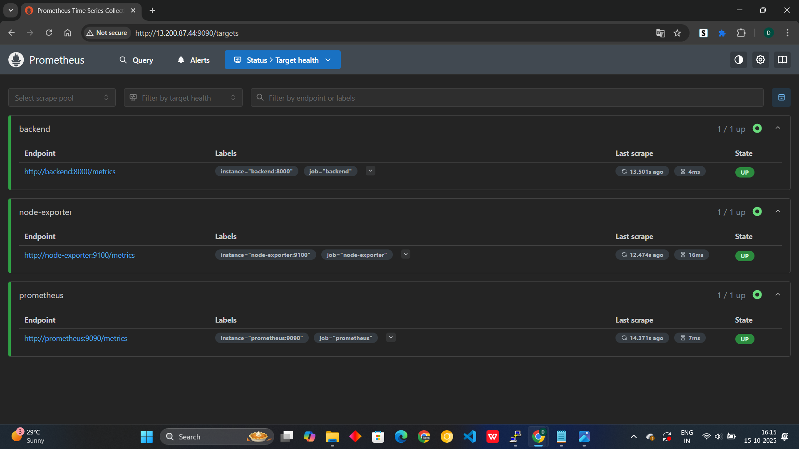
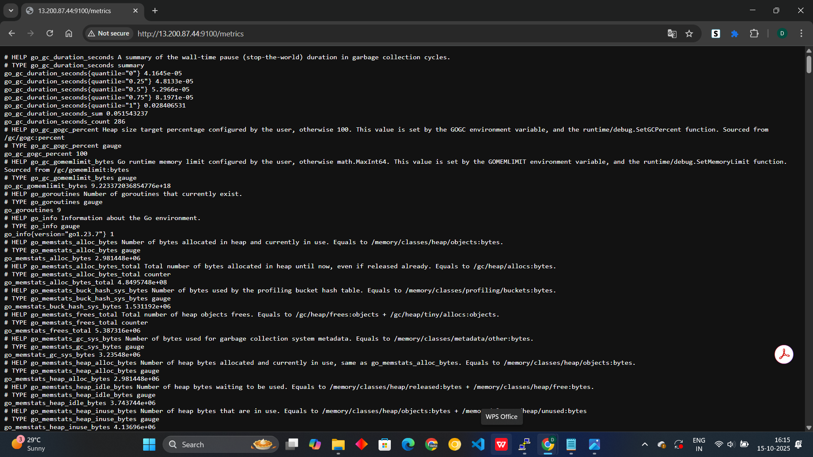
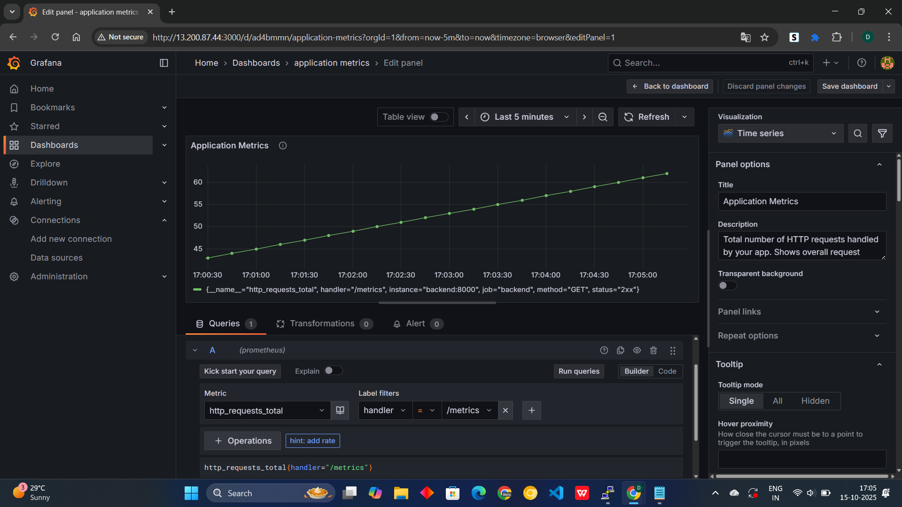
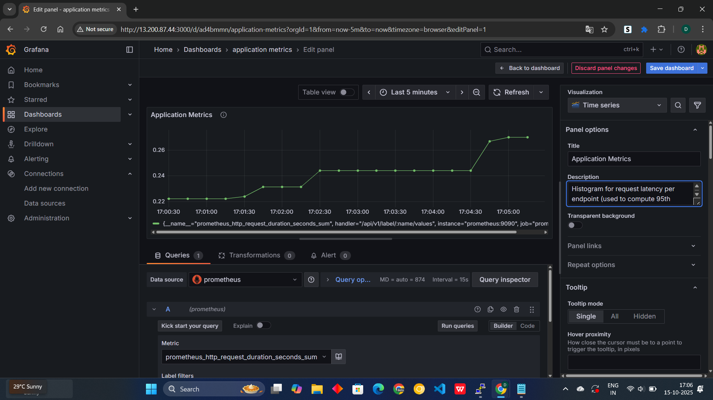
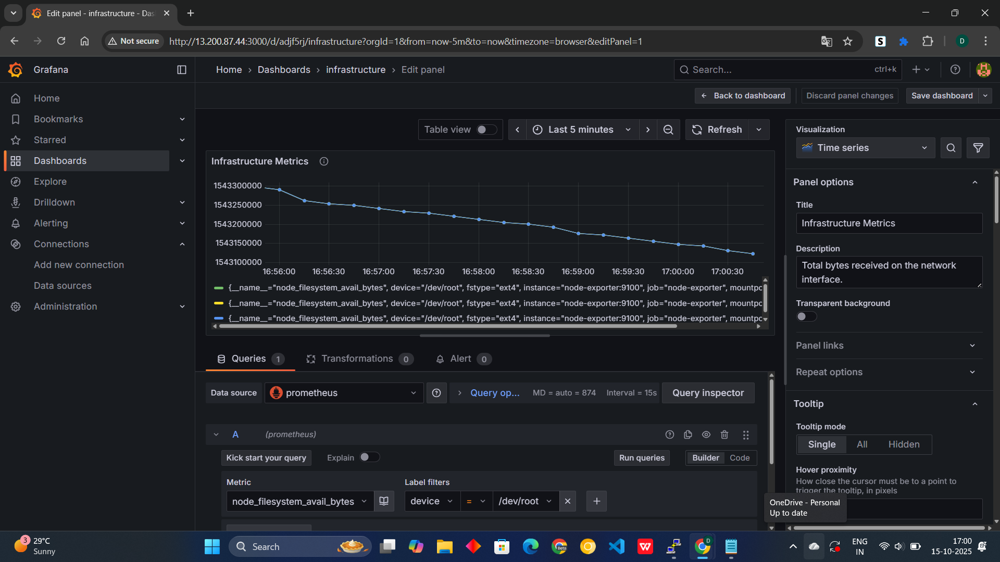
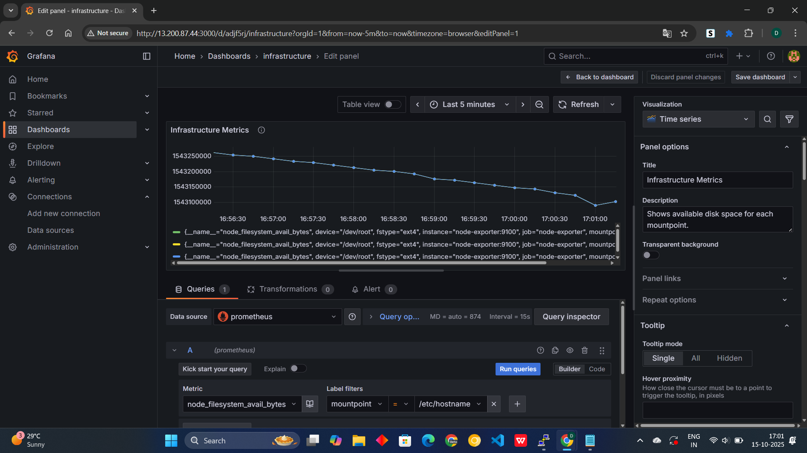
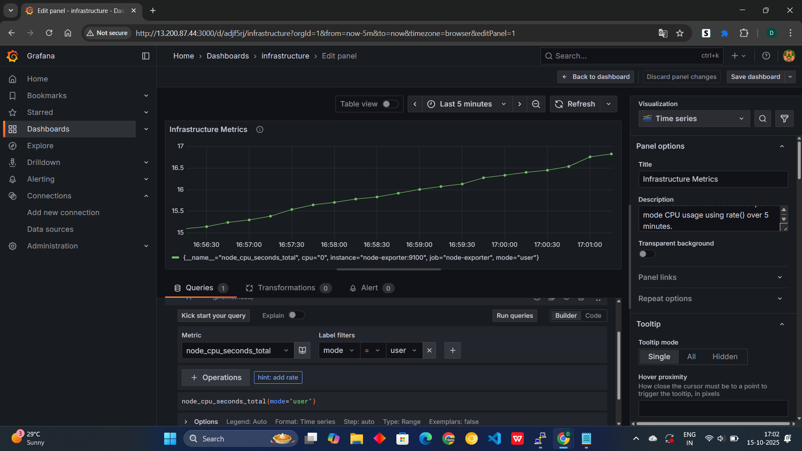

# Fusionpact DevOps Challenge

## Level 1: Cloud Deployment

### 🚀 Objective

Deploy the full stack application on an AWS Ubuntu EC2 instance using Docker and Docker Compose with MySQL persistent storage.  
- **Frontend:** Accessible on port `80`  
- **Backend:** Accessible on port `8000`

---

### 📁 Repository Structure

```
fusionpact-devops-challenge/
├── README.md                                # Project documentation (with pipeline info)
├── SOP CREATE HOME WEBPAGE USING NGINX SERVER.pdf  # SOP file
├── backend/                                 # Backend microservice
│   ├── Dockerfile                           # Dockerfile for backend
│   ├── requirements.txt                     # Python dependencies
│   └── app/
├── frontend/                                # Frontend microservice
│   ├── Dockerfile                           # Dockerfile for frontend
│   └── Devops_Intern.html                   # Frontend HTML file
├── docker-compose.yml                       # Multi-container orchestration
├── prometheus.yml                           # Prometheus monitoring config
└── jenkins_home/                            # Jenkins persistent data (mounted from host)
```

---

### 🛠️ Prerequisites

- Docker installed on the server
- Docker Compose installed
- AWS EC2 Ubuntu instance with security groups allowing:
  - HTTP (`80`)
  - Backend (`8000`)
  - MySQL (`3306`, optional for direct access)

---

### 📝 Deployment Steps

1. **Clone the Repository**
    ```bash
    git clone <YOUR-FORKED-REPO-URL>
    cd fusionpact-devops-challenge
    ```

2. **Build and Start Containers**
    ```bash
    sudo docker-compose down --volumes --remove-orphans
    sudo docker-compose up -d --build
    ```

3. **Verify Running Containers**
    ```bash
    sudo docker ps
    ```
    You should see `frontend`, `backend`, and `mysql-db` containers running.

---

## 🌐 Accessing the Application

- **Frontend:** [http://13.200.87.44/](http://13.200.87:44/)
- **Backend:** [http://13.200.87:44:8000](http://13.200.87:44:8000)
  
---

### 🗄️ MySQL Persistence Verification

1. **Connect to MySQL container:**
    ```bash
    sudo docker exec -it mysql-db mysql -u fusionuser -p
    # Password: fusionpass
    ```

2. **Verify database and tables:**
    ```sql
    USE fusionpact;
    SHOW TABLES;
    ```

3. **Insert test data to verify persistence:**
    ```sql
    CREATE TABLE test_table (id INT AUTO_INCREMENT PRIMARY KEY, name VARCHAR(50));
    INSERT INTO test_table (name) VALUES ('Level1 Test');
    SELECT * FROM test_table;
    ```

4. **Stop and restart containers, then verify data still exists.**

> **Note:**  
> The MySQL database uses a Docker volume (`mysql_data`) to persist data across container restarts.

---

### 🐳 Docker Compose Services

| Service   | Ports      | Description                      |
|-----------|------------|----------------------------------|
| frontend  | 80:80      | Nginx serving HTML frontend      |
| backend   | 8000:8000  | FastAPI backend service          |
| db        | 3306:3306  | MySQL database with persistence  |

---

### 📸 Screenshots (for SOP)

- 
- 
- 

---

## Level 2 – Monitoring & Observability

### 🚦 Objective

Implement complete observability for the deployed application by monitoring both application metrics and infrastructure metrics using Prometheus, Node Exporter, and Grafana.

---

### 🧩 Components Used

| Component      | Purpose                                                        |
| -------------- | -------------------------------------------------------------- |
| Prometheus     | Collects metrics from the backend application and Node Exporter|
| Grafana        | Visualizes metrics in dashboards for real-time monitoring      |
| Node Exporter  | Exposes host-level metrics (CPU, memory, disk) for Prometheus  |
| Docker Compose | Deploys all services in isolated containers                    |

---

### ⚙️ Setup Instructions

#### 1. Docker Compose

Use the following [`docker-compose.yml`](https://github.com/DhruvShah0612/fusionpact-devops-challenge/blob/main/docker-compose.yml):

---

#### 2. Prometheus Configuration ([`prometheus.yml`](prometheus.yml))

[`prometheus.yml`](https://github.com/DhruvShah0612/fusionpact-devops-challenge/blob/main/prometheus.yml):

---

#### 3. Start Services

```sh
docker-compose up -d
```

Verify containers are running:

```sh
docker ps
```

---

#### 4. Access Prometheus

- URL: `http://<EC2-PUBLIC-IP>:9090`
- Prometheus UI allows you to query and visualize metrics directly.

**Prometheus UI Screenshot Example:**  


---

#### 5. Access Node Exporter

- URL: `http://<EC2-PUBLIC-IP>:9100/metrics`
- This endpoint exposes host-level metrics in plain text format.

**Node Exporter Screenshot Example:**  


---

#### 6. Access Grafana

- URL: `http://<EC2-PUBLIC-IP>:3000`
- Username: `admin`
- Password: `admin`

Add Prometheus as a data source:

- URL: `http://<EC2-PUBLIC-IP>:9090`
- Click **Save & Test** → should show "Data source is working" ✅

---

#### 7. Create Dashboards

**Application Metrics Panels:**

| Metric                      | Label Filter            | Example Value           | Description                                           |
|-----------------------------|------------------------|------------------------|-------------------------------------------------------|
| `http_requests_total`       | handler, method, status| /api/login, GET, 200   | Total HTTP requests per endpoint                      |
| `http_request_duration_seconds` | handler, le, method | /api/register, le="0.5"| Request latency per endpoint (used for percentiles)   |

- 
- 

**Infrastructure Metrics Panels (Node Exporter):**

| Metric                                 | Label Filter        | Example Value | Description                |
|-----------------------------------------|--------------------|--------------|----------------------------|
| `node_cpu_seconds_total`                | mode, instance     | user, idle   | CPU usage per mode         |
| `node_filesystem_avail_bytes`           | mountpoint, instance| /, /home    | Disk space available       |
| `node_network_receive_bytes_total`      | interface, instance| eth0         | Network bytes received     |

- 
- 
- 

---

## Level 3 – CI/CD Pipeline

This section describes the Level 3 CI/CD pipeline for the FusionPact DevOps Challenge, using Jenkins, Docker, and AWS EC2.

---

### 🚀 CI/CD Pipeline Overview

This pipeline automates **build, push, and deploy** stages using Jenkins and Docker.

#### **Pipeline Stages**

1. **Checkout Code**
    - Pulls latest code from GitHub repository (`HTTPS`) using `github-https` credentials.

2. **Docker Test**
    - Checks Docker version to ensure Jenkins can access Docker.

3. **Build Docker Image**
    - Builds Docker images from `backend` and `frontend` Dockerfiles.
    - Tags image as `dhruvshah0612/fusionpact:<BUILD_NUMBER>`.

4. **Push to Docker Hub**
    - Pushes the Docker image to Docker Hub using `dockerhub-creds`.

5. **Deploy**
    - Stops existing container if running.
    - Removes old container.
    - Runs the new Docker container on EC2 host.

6. **Post Actions**
    - Cleans up dangling Docker images to save space.

---

### 📝 Jenkins Pipeline Script Example

<add pipline link>

---

### 🛠️ Jenkins Container Setup

To run Jenkins with Docker access:

```sh
docker run -d \
  --name jenkins-docker \
  -p 8080:8080 -p 50000:50000 \
  -v /home/ubuntu/jenkins_home:/var/jenkins_home \
  -v /var/run/docker.sock:/var/run/docker.sock \
  -e DOCKER_GROUP_ID=$(getent group docker | cut -d: -f3) \
  jenkins/jenkins:lts
```

- Persist Jenkins data in `/home/ubuntu/jenkins_home`
- Share Docker socket for Jenkins to access Docker

---

### 🔑 Credentials Used

| Credential ID   | Type               | Purpose                                 |
|-----------------|--------------------|-----------------------------------------|
| github-https    | Username/Token     | GitHub HTTPS code checkout              |
| dockerhub-creds | Username/Password  | Docker Hub push                         |
| ec2-ssh-key     | Private key (opt.) | Deploy to remote EC2 (if separate host) |

---

### ✅ Verification

- `docker ps` on EC2 shows running containers.
- `curl http://<EC2-PUBLIC-IP>:8080` → Backend app accessible.
- Jenkins shows all stages successful.
- Docker inside Jenkins can build and push images.
- Dangling images cleaned automatically.

---

### 🌐 Access

- Jenkins Web UI: [http://<EC2-PUBLIC-IP>:8080](http://<EC2-PUBLIC-IP>:8080)
- Backend App: [http://<EC2-PUBLIC-IP>:8080](http://<EC2-PUBLIC-IP>:8080)

---

This setup ensures a fully automated CI/CD pipeline from GitHub → Jenkins → Docker → EC2 deployment.

---
